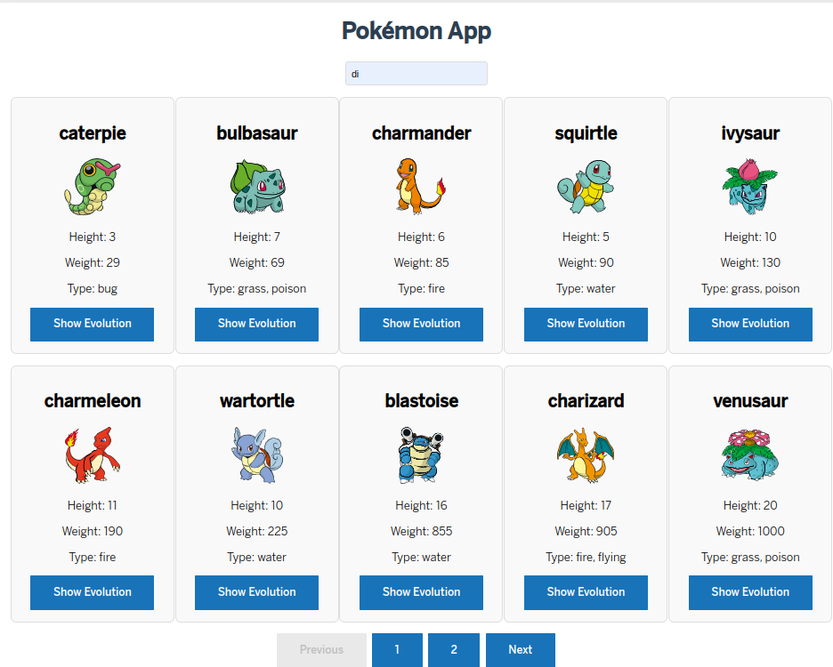
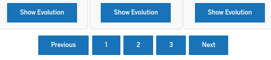

# @meraki/app-pokemon

## Package info

This package provides the `AppPokemon` component, a custom LitElement-based element that allows viewing and searching information about Pokémon using the PokéAPI.

### Package installation

Installation using NPM

```bash
npm install @meraki/app-pokemon 
```
packege.json:  "dependencies": {
    "@meraki/pokemon-dm": "version"
  },
 
```bash
npm install 
``` 
### Prerequisites

- Node.js v14+
- LitElement v2+
- Access to the PokéAPI for real-time data consumption

### Entry points & exports

- (Default entry point)
  - AppPokemon (Class)
- app-pokemon.js
  - app-pokemon (Custom Element)


## AppPokemon (Class) app-pokemon (Custom Element) 

### Extends from

LitElement (lit-element package)

### Usage

Import and extend the class:

```js
import { AppPokemon } from '@meraki/app-pokemon';

class ExampleElement extends AppPokemon {
  ...
}
```

Use the custom element (defined globally):

```js
import '@meraki/app-pokemon/app-pokemon.js';
```

```html
<app-pokemon ...>
  ...
</app-pokemon>
```

### Description


This component, The AppPokemon component is a custom web component built with LitElement for displaying and searching Pokémon. This component allows users to view Pokémon details, search by name or ID, and see evolution chains where available. It fetches data from the PokéAPI and provides features such as pagination, evolution views, and error handling through a modal.

Example:

```html
  <app-pokemon></app-pokemon>
  <app-pokemon
  searchQuery="bulbasaur"
  perPage="10"
  currentPage="1"
  detailOpened="true"
></app-pokemon>

```



### Properties

- **pokemons**: `Array`  
  _(type: Array)_  
  Description: List of all available Pokémon.

- **searchResults**: `Array`  
  _(type: Array)_  
  Description: List of Pokémon search results.

- **selectedEvolutions**: `Array`  
  _(type: Array)_  
  Description: Selected evolutions for the current Pokémon.

- **searchQuery**: `string`  
  _(type: String)_  
  Description: Current search query to find Pokémon.

- **currentPage**: `number`  
  _(type: Number)_  
  Description: Current page number in the list of results.

- **totalPokemons**: `number`  
  _(type: Number)_  
  Description: Total number of Pokémon available in the database.

- **perPage**: `number`  
  _(type: Number)_  
  Description: Number of Pokémon displayed per page.

- **loading**: `boolean`  
  _(type: Boolean)_  
  Description: Loading state of the application (true if loading).

- **detailOpened**: `boolean`  
  _(type: Boolean, attribute: false)_  
  Description: Indicates if the detail view is open or closed.

### BBVA Usage Component

The BBVA usage components are designed to facilitate seamless interactions within web applications. Each component serves a specific purpose, enhancing user experience and functionality.

- **bbva-web-button-default**: A customizable button component that provides users with a consistent and visually appealing interface for performing actions throughout the application. It supports various states (default, hover, active) and can be easily styled to match the application's branding.




- **bbva-progress-content**: This component displays progress indicators for ongoing tasks, allowing users to visualize the completion status of processes such as uploads, downloads, or any time-consuming actions. It improves user engagement by providing feedback during long-running operations.


- **bbva-help-modal**: A modal dialog that offers contextual help and guidance to users. This component can display FAQs, tips, or detailed instructions to assist users in navigating the application effectively. It enhances usability by ensuring that help is readily available when needed.


This README includes more complete HTML examples, demonstrating how to integrate the `app-pokemon` component into an HTML application with configured events and properties.